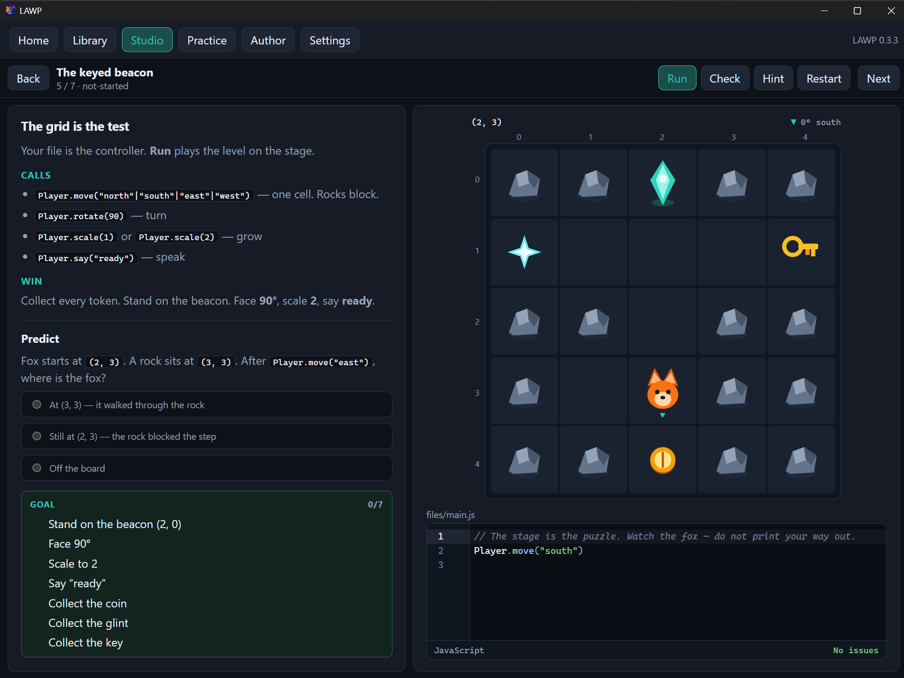

# LAWP

[](https://github.com/dobrado76/LAWP/releases/latest)
[](LICENSE)


**Learn Anything While Playing** — a local Windows learning studio.

Short lessons. A world you can change. Instant consequence. Then *why*. No account, no subscription, no other repo.




## Why it exists

Interactive courses already proved **explain → try → feedback**. They also proved the failure mode: catalog-as-product, paywalls, green checks without understanding.

LAWP is the other shape:

| Instead of | LAWP |
| --- | --- |
| A coding school with extra subjects taped on | A **general LMS** — any subject is a JSON cartridge |
| Quizzes that score a guess | **Play** — predict, act, see, explain |
| “Submit until green” | **Mastery** — independent pass, transfer, Why |
| Cloud workspace + monthly fee | **This PC** — `%APPDATA%\LAWP`, cartridges as `.zip` |

## Run it

```bash
npm install
npm run dev
```

Windows installer:

```bash
npm run dist
```

`dev` and the installed app share **`%APPDATA%\LAWP`**. Settings, learners, and user packs survive reinstall. The installer never writes that folder.

| Script | What it does |
| --- | --- |
| `npm run dev` | Electron + Vite, same profile as installed |
| `npm run dist` | Bump PATCH, then `release/` Windows build |
| `npm run dist:nobump` | Same build, keep the current version |
| `npm run typecheck` | Main + renderer TypeScript |
| `npm run test` | Vitest |

## What you can do today

**Learn.** Open **circuits** and make a lamp brighter without blowing the limit. Walk a **fox** to a beacon in Python, or take the full **JavaScript** expert path (language, DOM, Node, tests). Your edits come back when you change lessons. Restart restores starters and keeps history.

**See why.** A miss names a misconception — or asks a diagnostic instead of faking one. Concept hints are free. Assist hints mark the attempt.

**Keep work.** Creations live under your learner folder. Export a circuit or a project out of LAWP.

**Author.** Template → edit `lesson.json` → validate → export zip. Library **Install from ZIP** / **Export ZIP** at pack or lesson grain.

**Stay local.** Several named learners on one PC. Progress never sits inside a cartridge.

## How a lesson works

```
Predict  →  Act (world or code)  →  See  →  Explain
```

- Non-code subjects use **`world-v1`** (data + rules in main — pack strings are never `eval`’d).
- Code subjects spawn Python or Node in a sandbox. Graphical lessons use the closed **`player-v1`** API (`move` / `rotate` / `scale` / `say`). Main grades the resulting world.
- Check writes a **snapshot**. Best is score, then independence — not speed.

## Docs

What is in the build: [docs/STATUS.md](docs/STATUS.md). Locked behavior: [docs/DECISIONS.md](docs/DECISIONS.md). Version **0.2.0** — [CHANGELOG.md](CHANGELOG.md), this minor: [RELEASE_NOTES.md](RELEASE_NOTES.md).

| File | What it defines |
| --- | --- |
| [PRODUCT_SPEC.md](docs/PRODUCT_SPEC.md) | Surfaces, loop, non-goals |
| [PEDAGOGY.md](docs/PEDAGOGY.md) | Mastery, hints, misconceptions |
| [CONTENT_MODEL.md](docs/CONTENT_MODEL.md) | Cartridges, `world-v1`, progress |
| [CURRICULA.md](docs/CURRICULA.md) | Circuits, Python, JavaScript, React |
| [ARCHITECTURE.md](docs/ARCHITECTURE.md) | Main / preload / renderer |
| [IPC_CONTRACT.md](docs/IPC_CONTRACT.md) | Typed IPC |
| [UI_DESIGN.md](docs/UI_DESIGN.md) | Studio chrome |
| [SECURITY.md](docs/SECURITY.md) | Paths, trust, runners |
| [BUILD.md](docs/BUILD.md) | AppData, icons, tsconfig |

This workspace is the product. Do not import, copy, or link another codebase.

## Contributing

You are welcome here. Lessons, Why copy, editor UX, docs, and honest bug reports all make LAWP better.

- Open an issue for something broken or unclear. A short repro in Studio beats a novel.
- Pull requests: one idea, tests if you touch runners or grading, a line in [CHANGELOG.md](CHANGELOG.md).
- New lessons are original JSON cartridges. Do not scrape or rewrite Codefinity (or anyone else’s) materials.
- Match [docs/DECISIONS.md](docs/DECISIONS.md) and [docs/STATUS.md](docs/STATUS.md). If you lock new behavior, update the decisions table.

If you are unsure where to start, play the circuits pack and the fox grid, then pick the first thing that got in your way.

## License

LAWP is free software under the [GNU General Public License v3.0](LICENSE). You can run it, study it, share it, and change it under those terms. There is no warranty.
